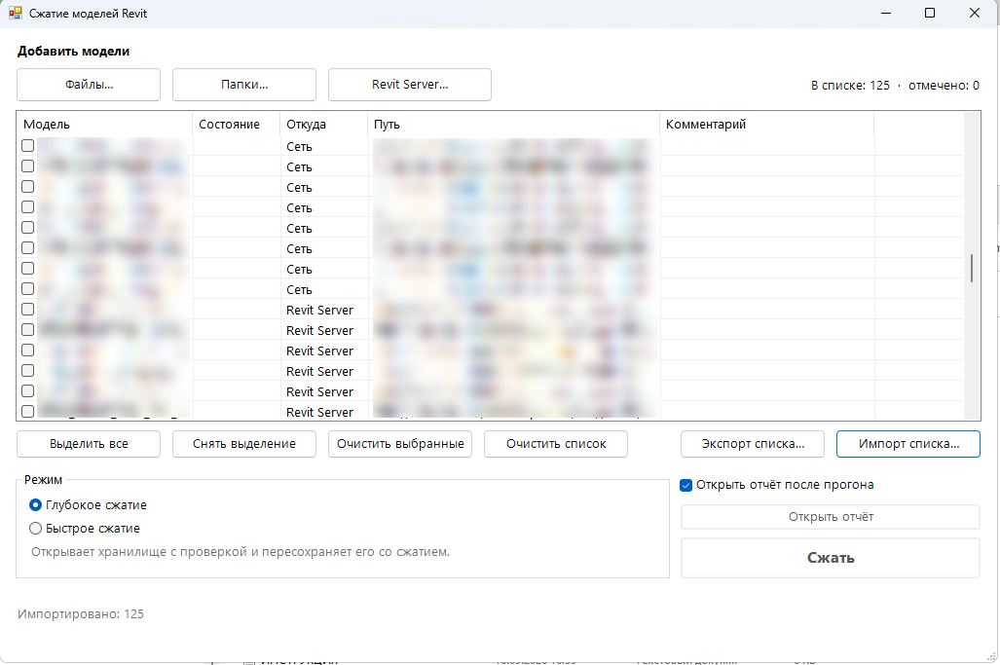
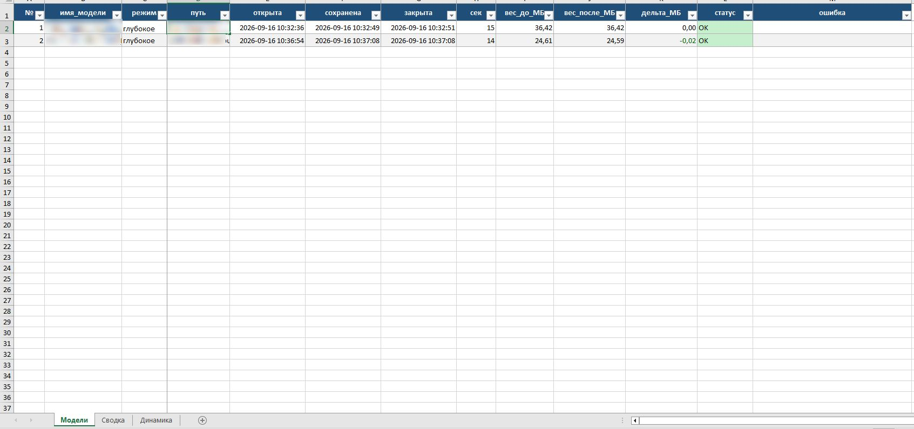
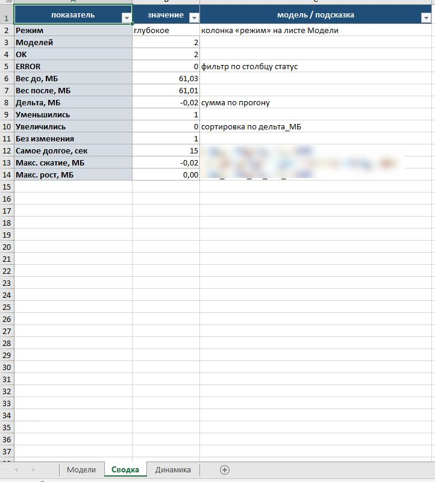

# BIM Revit Automation Portfolio

Operator-facing automation for Autodesk Revit: **compact workshared models**, rename / year-upgrade / relink across many models, weekly health audits, units / levels alignment, alerts on exchange folders.

I write the **task scripts + Windows toolkits** (pick models → run → Excel report). [Revit Batch Processor](https://github.com/bvn-architecture/RevitBatchProcessor) (RBP) is one open-source batch host I use for Revit API jobs — not my product, and not every case needs it (see [Third-party](#third-party)).

| | |
|---|---|
| **Author** | [assssdrew](https://github.com/assssdrew) |
| **Stack** | Revit API · IronPython · PowerShell · WinForms · OpenXML · FTP / ntfy |
| **Focus** | Workshared / Revit Server (`RSN://`) pipelines, safety-first writes |
| **Language** | [Русский README](README.ru.md) |

> Tested on real working models. Batch workflows are on average about 4–5× faster than the same work done by hand. Examples are anonymised.

---

## Quick start (3 steps)

For the Revit API cases (01, 02, 03, 05, 06). Case 04 is a standalone PowerShell watcher — see its README.

1. **Prepare a PC** with Windows, PowerShell, the Revit year that matches your models, and [Revit Batch Processor](https://github.com/bvn-architecture/RevitBatchProcessor). Copy the case `src/` folder next to it and edit `servers.cfg` (placeholder Revit Server hosts in this repo).
2. **Build the model list** with the case's picker (`choose_models_path.cmd`; case 05 is `Сжатие.vbs`, case 06's new window is `Операции с моделями.vbs`).
3. **Run the task** in RBP (e.g. `health_check.py`) on a **disposable local copy first**, then read the report (CSV and Excel report). Details and the exact RBP settings are in each case README.

---

## Cases

| # | Case | Status | Impact |
|---|------|--------|--------|
| 01 | [Project Units + RSN](cases/01-project-units/) | Tested on real working models | On average about 4–5× faster than manual work; batch Length accuracy across disk / UNC / `RSN://` |
| 02 | [Health Check](cases/02-health-check/) (v1.4.0) | Tested on real working models; read-only (no model changes) | On average about 4–5× faster than manual work; health metrics and RVT links in one Excel report and CSV batch |
| 03 | [Levels & Grids](cases/03-levels-grids/) | Tested on real working models; MVP scope (Apply on base files only) | On average about 4–5× faster than manual work; cascade BF↔AR and disciplines↔BF audit in report sessions |
| 04 | [FTP model alerts](cases/04-ftp-model-alerts/) | Tested on real working models | Phone push when shared FTP folders change, without watching the client |
| 05 | [Compact save](cases/05-compact-save/) | Tested on real working models; RSN deep mode on a limited number of runs | On average about 4–5× faster than manual work; long lists (e.g. ~125 models) in one unattended run; file-size change varies (often small, e.g. 61.03→61.01 MB; up to about −11.6% on one early fast-mode model) |
| 06 | [Model operations](cases/06-model-ops/) (v3.0.0) | Tested on real working models | On average about 4–5× faster than manual work; staged Save As, move, and relink from one saved job plan |

#### Case 05 — Compact save (screenshots)

Operator window (deep mode, mixed network and Revit Server list):



Excel report — sheet «Модели», deep mode, two models, both OK:



Excel report — sheet «Сводка», 61.03 MB → 61.01 MB:



#### Case 02 — Health Check (screenshot)

Link check across a model hub — Excel report:


New cases are added as folders under `cases/` — see [docs/HOW_TO_ADD_CASE.md](docs/HOW_TO_ADD_CASE.md).
Also in `docs/`: a [draft Navisworks clash-tolerance matrix](docs/navisworks-clash-tolerances.md) (a discussion document, not code and not a company standard).

---

## Featured

**Compact save** ([case 05](cases/05-compact-save/)) — operator UI (`Сжатие.vbs`): **fast** (Create New Local, Sync Compact) and **deep** (central + Audit, Save As same central with Compact). See the [case 05 screenshots](#case-05--compact-save-screenshots) above.

**Model operations** ([case 06](cases/06-model-ops/)) — rename, folder / Revit year, and RVT relink in staged passes via `Операции с моделями.vbs` → `presets.ps1` (with `start_ops.ps1` and `job_lib.ps1`).

---

## Problem → approach

**Weekly reality on a multi-discipline project:** architecture updates land on the server; base files (BF) and many discipline models must stay aligned on units, model health, levels and grids. Centrals also need periodic Compact. A park move (names / year / links) has to be staged so hosts are not saved before their links exist.

Manual open-check-fix does not scale. These toolkits:

1. Build a model list (folder / files / Revit Server)
2. Run the Revit API job (batch host or a dedicated window)
3. Emit Excel reports with status highlighting (**GREEN / YELLOW / RED**) — or size before/after for Compact
4. Apply writes only where the risk is understood (units; BF levels/grids; Compact with an explicit mode; model-ops after Save job) — never blind coordinate fixes

---

## Project scale / context

Typical workflow context (anonymised examples). Figures describe usual batch size on a multi-discipline project.

| Item | Context | Impact |
|------|---------|--------|
| Weekly cascade | ~5–6 base files (BF↔AR), then up to ~80 discipline models (vs BF) | About 4–5× faster than manual; one audit report session per wave |
| Model operations | ~50+ models, mixed UNC / `RSN://` | About 4–5× faster than manual; one job plan drives detach / Save As / move / relink passes |
| Units / RSN | Live Revit Server models | About 4–5× faster than manual; one batch for Length accuracy across disk and `RSN://` |
| Compact save | Tested on working models; RSN deep on a limited number of runs | About 4–5× faster than manual; long lists (e.g. ~125 models) in one run; size delta often small (61.03→61.01 MB on a 2-model deep run) |
| Health Check | Read-only workshared audit | About 4–5× faster than manual; one Excel report plus CSV across the hub |
| Levels & Grids | MVP scope (Apply on base files only) | About 4–5× faster than manual; BF-first cascade before discipline reports |
| FTP model alerts | Shared exchange folders | Scheduled poll → push without manual FTP watch |

---

## Safety rules

Automation that can destroy a federated model is worse than no automation.

- **Audit** scripts never Save / Sync / Relinquish
- **Apply** is a separate script / explicit list (e.g. BF only)
- **Compact** is a write: fast uses Create New Local; deep opens the central with Audit and saves the same central with Compact (no Detach). RSN deep mode needs RBP patch v4 (`RSN_PATCH_PS_v4`); tested on a limited number of runs.
- **Model operations** writes only after Save job; Detach is the local upgrade buffer, not the live central
- Coordinates, PBP, Survey Point, True North, Shared Coordinates are **out of scope** here — report only (Health Check), never auto-fix
- Tolerances are mandatory to avoid false RED on floating-point noise

Details: [docs/SAFETY.md](docs/SAFETY.md)

---

## Stack and scope

- **Revit API** task scripts (IronPython) run through [Revit Batch Processor](https://github.com/bvn-architecture/RevitBatchProcessor); operator tooling in **PowerShell** and **WinForms**; **OpenXML** Excel reports (no Excel COM on UNC).
- **Focus:** workshared and Revit Server (`RSN://`) models — read-only audits, controlled batch writes (units, levels/grids on base files, Compact, staged model operations).
- **Platform:** Windows. Case 04 adds FTP polling and phone push (ntfy / Telegram).
- **Docs:** sample reports under `samples/`, screenshots under `docs/img/`, safety notes in [docs/SAFETY.md](docs/SAFETY.md).

---

## Third-party

- **[Revit Batch Processor](https://github.com/bvn-architecture/RevitBatchProcessor)** (Dan Rumery, BVN) is the batch host for the RBP-based cases. It is **not** included in this repository; install it separately. RBP is licensed under **GPL-3.0**.
- `cases/06-model-ops/src/rbp_open_fail_patch/` contains **two modified copies of RBP scripts** (`revit_dialog_util.py`, `revit_failure_handling.py`) with the original “Copyright (c) 2020 Dan Rumery, BVN” notice. They are **derivative works of RBP and are covered by GPL-3.0**, not by this repository's MIT licence.
- `cases/01-project-units/src/rbp_rsn_patch/` (and its copy in case 05) is a PowerShell script that edits **your installed** RBP `Scripts` folder to accept `RSN://` paths (it creates `*.bak_before_rsn` backups); it does not ship RBP code.

See [NOTICE](NOTICE) for details.

---

## Repository layout

```text
bim-revit-automation/
  README.md / README.ru.md     ← portfolio hub
  NOTICE                       ← third-party notices (RBP, GPL-3.0 patch files)
  cases/
    01-project-units/src/
    02-health-check/src/
    03-levels-grids/src/
    04-ftp-model-alerts/src/   ← FTP poller + phone alerts (no Revit API)
    05-compact-save/src/       ← operator UI + Compact task
    06-model-ops/src/          ← presets UI + Save As / relink pipeline
  samples/                     ← anonymised report snippets
  docs/
    img/                       ← compact and health-check screenshots
```

Copy a case `src/` onto a PC with the matching Revit year. Case 04 runs standalone on Windows (Task Scheduler). Case 05 starts from `Сжатие.vbs`. Case 06 starts from `Операции с моделями.vbs`; `run_cascade.cmd` is the older menu.

---

## Requirements

- Autodesk Revit (year matching the models; units toolkit targets 2022+)
- Windows + PowerShell
- [Revit Batch Processor](https://github.com/bvn-architecture/RevitBatchProcessor) for the Revit API batch cases (01–03, 05–06)

---

## Disclaimer

Scripts are provided as portfolio / starting points. Validate on a disposable local before any production write. Project paths, names and server hosts are sanitised or replaced with placeholders in this public repo.
