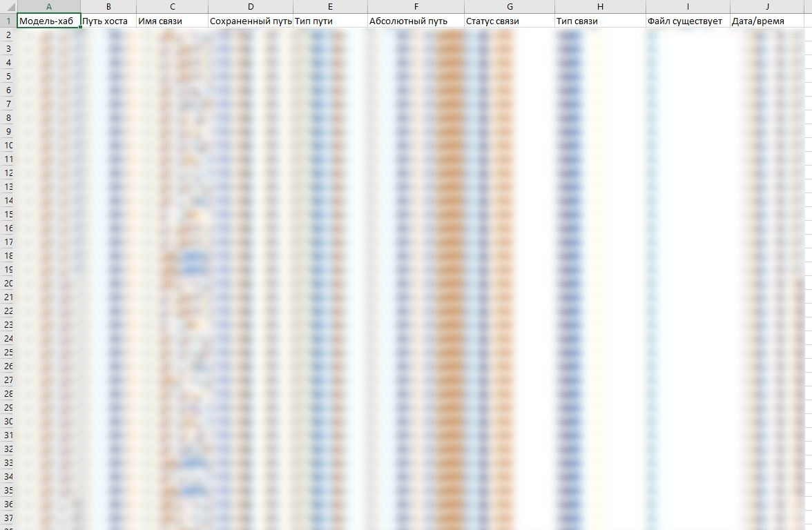

# Case 02 — Model Health Check

[← Portfolio hub](../../README.md) · [RU](README.ru.md)

## Problem

BIM managers need a weekly “is this model healthy?” signal across many centrals — CAD imports, in-place families, unused types, far geometry, link inventory — without opening every file and without risking Save/Sync.

## Solution

Read-only RBP audit (**v1.4.0**):

- Metrics in waves A / B / C (links, families, views/sheets, MEP connectors estimate, far elements, …)
- Traffic-light status from `thresholds.cfg`
- CSV append per model + **one coloured XLSX** at end of batch (OpenXML, no Excel COM)
- Sheets: Summary + RVT Links

## Screenshot

Excel sheet of the link health check. Model names and paths are blurred.

## Project scale / context

| Item | Result |
|------|--------|
| Status | Used on one project; read-only (no model changes) |
| Impact | Health metrics and RVT link inventory for many centrals in one coloured XLSX and CSV batch |
| Writes model? | **No** |
| Scale | Same picker as units — local / UNC / RSN lists |

## Safety

- Never Save / Sync / Relinquish
- Prefer closing locals without saving after the run
- Coordinate *metrics* may appear in the report; coordinate *fixes* are out of scope

## How to run

1. Copy `src/` to RBP Scripts
2. `choose_models_path.cmd` → list
3. `reset_report_session.cmd` → local XLSX folder
4. RBP: `health_check.py` + `rvt_list.txt` (Create New Local, Detach OFF)
5. Optional rebuild: `color_latest_report.cmd`

Code: [`src/`](src/)
